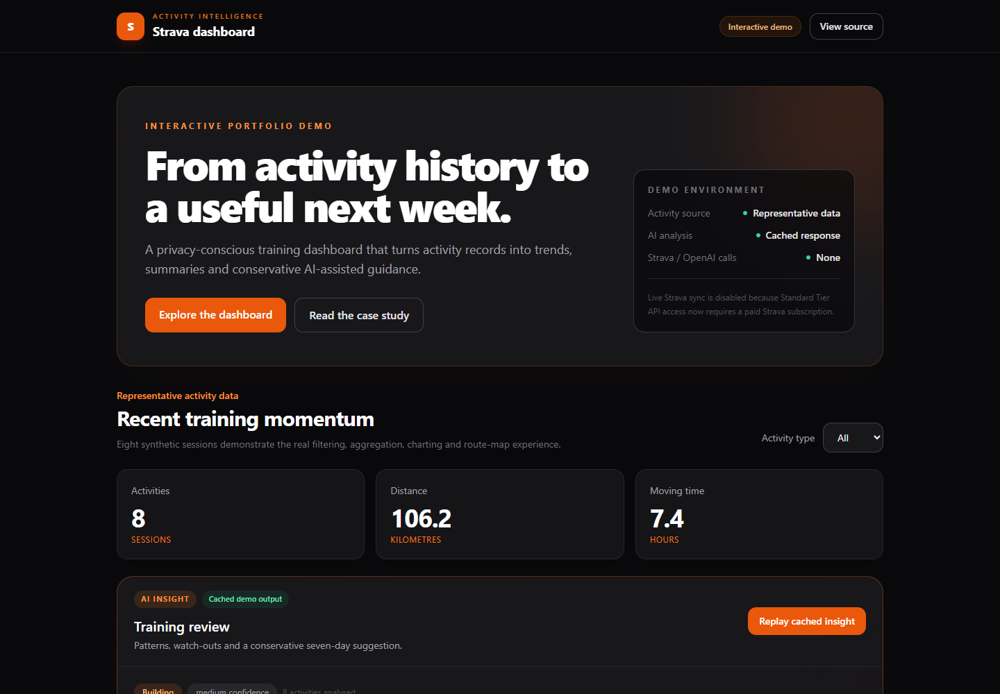
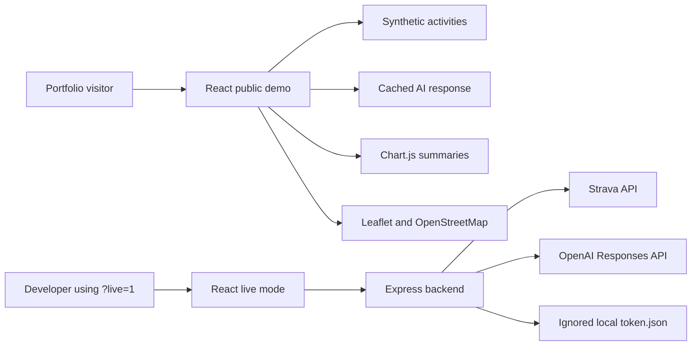

# Activity Intelligence — Strava Dashboard

> **Project status:** parked and maintained as a portfolio demonstration. The public demo remains usable, but further live Strava development is not currently planned.

A privacy-conscious React and Node.js project that turns activity history into training totals, weekly and monthly summaries, route previews and conservative AI-assisted guidance.

[Open the interactive demo](https://strava-dashboard-zeta.vercel.app) · [Read the user guide](docs/USER_GUIDE.md) · [Explore the architecture](docs/ARCHITECTURE.md)



## What the public demo shows

The normal application URL loads eight synthetic activities and a cached AI coaching response. Visitors can:

- filter running, cycling and swimming activities;
- inspect distance, moving-time and session totals;
- compare weekly and monthly summaries;
- explore the distance timeline;
- open synthetic route previews; and
- replay a representative AI training review without using API credit.

No Strava account, OpenAI key or backend is required. The demo makes no Strava or OpenAI requests. Opening a route preview does request map tiles from OpenStreetMap.

## Use the demo

1. Open the [public demo](https://strava-dashboard-zeta.vercel.app).
2. Change **Activity type** to filter the dashboard.
3. Select **Replay cached insight** to inspect the representative AI response.
4. Open **Show synthetic map** on an activity with a route.
5. Review the weekly and monthly tables to see how the same activity data is aggregated.

All displayed activities and routes are synthetic. See the [complete user guide](docs/USER_GUIDE.md) for an explanation of every section.

## Architecture at a glance



The application has two deliberately separate operating modes:

| Mode | Data | Backend | External services | Intended audience |
| --- | --- | --- | --- | --- |
| Public demo | Synthetic activities and cached AI output | Not required | OpenStreetMap tiles when maps are opened | Portfolio visitors |
| Live developer mode | Personal Strava activities | Required | Strava OAuth/API, optional OpenAI, OpenStreetMap | The project owner or a developer running locally |

Detailed component, sequence and privacy diagrams are in [Architecture](docs/ARCHITECTURE.md).

## Run the public demo locally

### Prerequisites

- Node.js 18 or later
- npm

```powershell
cd frontend
npm install
npm run dev
```

Open `http://localhost:5173/`. The default route always opens the synthetic demo.

## Optional live developer mode

Live mode remains in the repository as an educational reference. It is not the supported public experience and currently requires an eligible Strava developer account with an active subscription.

1. Copy `backend/.env.example` to `backend/.env` and add your own credentials.
2. Create `frontend/.env.local` containing:

   ```env
   VITE_API_BASE=http://localhost:5000
   ```

3. Start the backend and frontend in separate terminals:

   ```powershell
   cd backend
   npm install
   npm start
   ```

   ```powershell
   cd frontend
   npm install
   npm run dev
   ```

4. Open `http://localhost:5173/?live=1`.

The backend stores OAuth tokens in the ignored `backend/token.json` file. Never commit that file, `.env`, API keys, client secrets or refresh tokens. Full setup and troubleshooting instructions are in [Development](docs/DEVELOPMENT.md).

## AI training insights

Public demo mode replays a fixed structured response and consumes no OpenAI credit.

In live mode, the backend converts recent activities into a minimised training dataset before calling OpenAI's Responses API. Activity names and route geometry are excluded. The model receives dates, sport type, distance, moving time and any available numerical performance metrics. Responses are schema-constrained, response storage is disabled and the output is presented as training guidance—not medical advice.

## Documentation

- [User guide](docs/USER_GUIDE.md) — how to use and interpret the dashboard
- [Architecture](docs/ARCHITECTURE.md) — components, data flows and design decisions
- [Development](docs/DEVELOPMENT.md) — setup, configuration, commands and troubleshooting
- [Project status](docs/PROJECT_STATUS.md) — why the project is parked, known limitations and how to revive it

## Validation

The maintained frontend checks are:

```powershell
cd frontend
npm test
npm run lint
npm run build
```

The backend has a health endpoint but no automated test suite. This is recorded as known technical debt rather than hidden behind a passing placeholder command.

## Provider constraint

Strava made a subscription a prerequisite for Standard Tier API developers, including existing active developers from 30 June 2026. Provider rules can change; consult Strava's current developer documentation before attempting to revive live mode.

The repository retains live integration code for learning and future reference, while the supported portfolio path remains the cost-free synthetic demo. A future local CSV importer is described as a possible direction only; it has not been implemented.

## Privacy and attribution

- Demo activity and route data are synthetic.
- Personal OAuth tokens stay in an ignored local file.
- Activity names and route geometry are removed from live AI input.
- The project is independent and is not affiliated with or endorsed by Strava.
- Map previews use OpenStreetMap tiles through Leaflet.

## Licence

[MIT](LICENSE)
