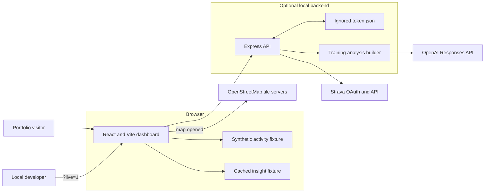
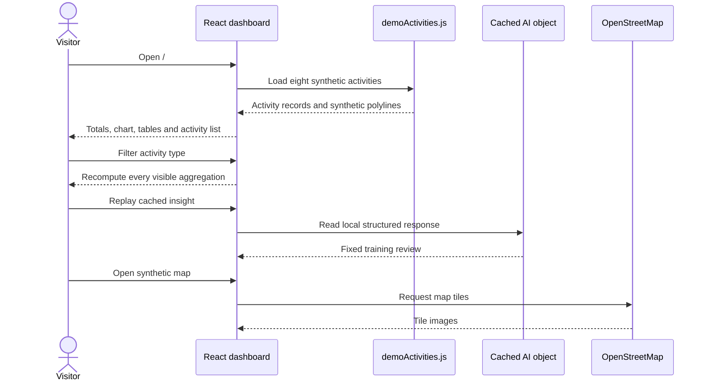
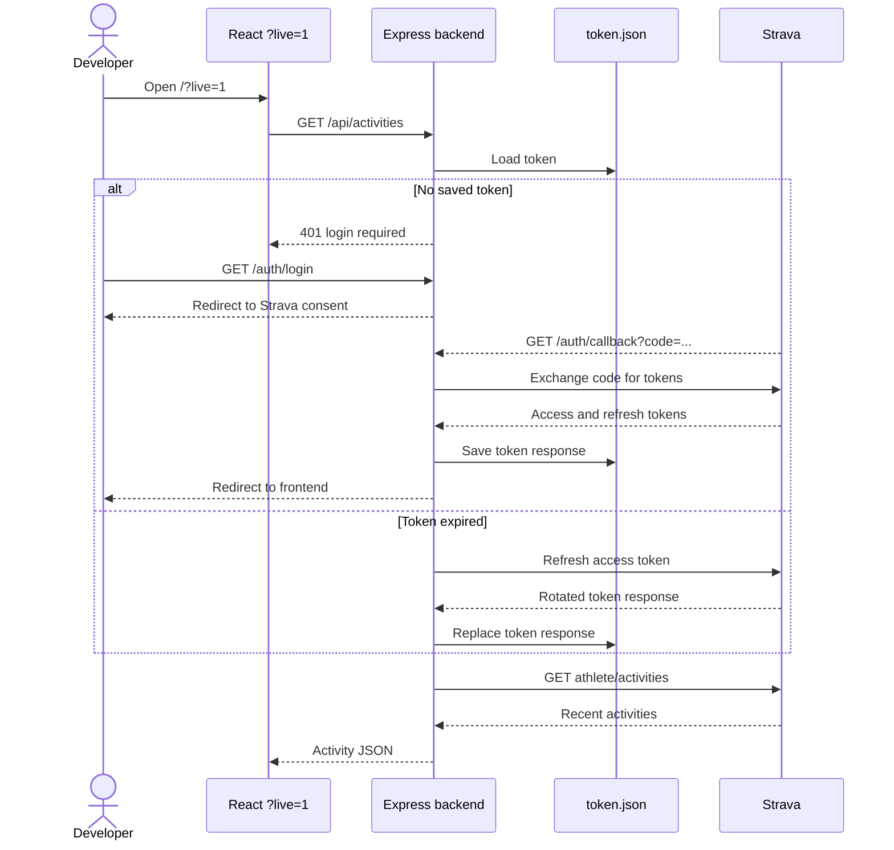
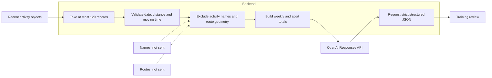
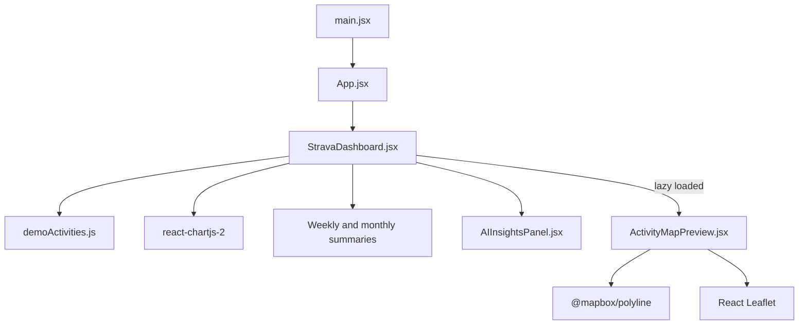

# Architecture

## Purpose and boundaries

Activity Intelligence began as a personal Strava integration and later became a demo-first portfolio project when provider access became subscription-gated. The repository now preserves both designs:

- a static public frontend that is safe and inexpensive to demonstrate; and
- a local Express integration that records how OAuth, token refresh and privacy-minimised AI analysis were implemented.

It is not a multi-user service, a complete Strava archive, a medical system or a production coaching platform.

## System context

The frontend is the only component required for public demo mode. The backend is intentionally absent from the public request path.

## Public demo sequence

No Strava or OpenAI request occurs in this sequence.

## Live OAuth and activity sequence

The current activities request does not provide pagination parameters or iterate through pages. Live mode therefore must not be described as a complete account archive.

## AI privacy boundary

The submitted activity fields are:

- ISO date;
- sport type;
- distance in kilometres;
- moving time in minutes; and
- optional elevation, heart-rate, speed and suffer-score numbers when present.

The request sets `store: false`, uses a strict JSON schema and asks the model for cautious, non-medical guidance. The backend also applies a small in-memory per-IP request limit.

## Frontend component map

`StravaDashboard.jsx` owns mode selection, activity loading, filters and all primary aggregation. `AIInsightsPanel.jsx` owns the cached/live AI states. `ActivityMapPreview.jsx` is lazy-loaded so the mapping bundle is only needed when the component is rendered.

## Backend modules

| Module | Responsibility |
| --- | --- |
| `backend/app.js` | Express startup, JSON limit, CORS allow-list and route mounting |
| `backend/routes/auth.js` | OAuth login, callback exchange and explicit refresh endpoint |
| `backend/routes/activities.js` | Valid-token acquisition and Strava activity request |
| `backend/routes/insights.js` | AI configuration checks, request limiting and Responses API call |
| `backend/services/trainingAnalysis.js` | Activity validation, minimisation, aggregation and output schema |
| `backend/utils/tokenStore.js` | Local JSON token persistence and automatic refresh |
| `backend/tokenService.js` | Historical wrapper around the local token store |

`backend/db.js` and the `pg` dependency are unused remnants. Despite the wrapper names `getTokenFromDB` and `saveTokensToDB`, active token persistence is file-based.

## Configuration and trust boundaries

- Browser-visible configuration is limited to `VITE_API_BASE`.
- Strava client secrets and the OpenAI key belong only in `backend/.env`.
- OAuth tokens belong only in the ignored `backend/token.json`.
- CORS accepts only configured origins, while requests without an `Origin` header are allowed for local tools.
- JSON request bodies are limited to 200 KB.
- AI request limiting is process-local and resets on restart; it is not a durable abuse-prevention system.
- OpenStreetMap is an external data recipient only when a map is opened.

## Design decisions

### Demo first

The default route never attempts OAuth. This keeps the portfolio experience reliable, private and independent of paid provider access.

### Live integration retained

The live path remains useful as a worked example of OAuth token rotation and server-side secret handling. It is hidden behind `?live=1` rather than presented as a generally available feature.

### Metric-only AI input

Training analysis does not require an activity title or map. Removing those fields reduces unnecessary personal and location data exposure while retaining the numerical patterns needed for a cautious summary.

### Graceful degradation

Expected provider failures map to understandable frontend states: missing login, inactive Strava application, unconfigured OpenAI key and upstream request failure.

## Known architectural limits

- local single-user token storage;
- no activity pagination or historical backfill;
- no durable cache or database;
- no backend automated tests;
- process-local AI rate limiting;
- fixed backend port;
- no CSRF state parameter in the preserved OAuth flow;
- historical, unused PostgreSQL scaffolding; and
- provider endpoints and requirements that may change after the archival date.

See [Project status](PROJECT_STATUS.md) before reviving the integration.
